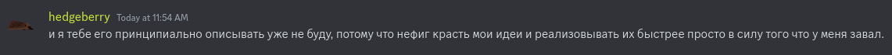

<div align="center">
    <h1> The Aber Programming Language </h1>
    <p> 🚀 Blazingly fast language with high-level abstractions and часоморфiзм 🕔</p>
    
    
</div>

###### Code examples

```rust
// Comment
function-call;
n:; // Pair

define-function[foobar] n: { n .* 2; } ;

call-library[name: "libc", function: "system"] ffi::c_str::from "rm -rf aber/\0";
```

###### @Hedgehogo live reaction





